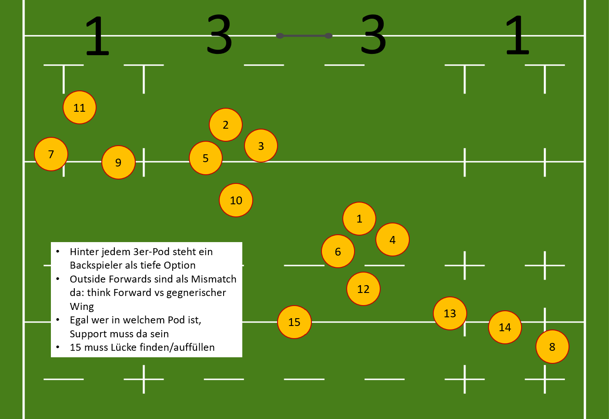
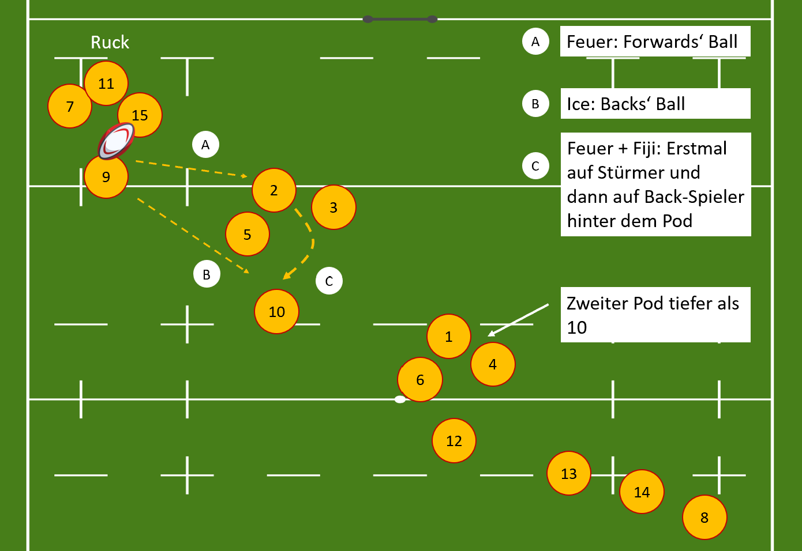
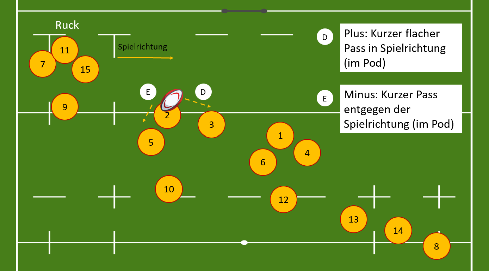

<!-- to do: -->

## 1. Structure

### Allgemeine Forward Struktur

## 2. Attack

### Calls
#### Feuer:
- von der 9 auf ein Stürmer-Pod

#### Eis:
- von der 9 auf eine Backs-Spielerin

#### Exit:
- der Ball wird bei einer Ruck-Situation rausgekickt
- entweder von der 9 selbst oder zuerst auf die 10/15 gepasst und dann gekickt

#### Fiji:
- der Ball wird von der 9 auf ein Stürmer-Pod gepasst
- vom Stürmer-Pod wird direkt auf eine Spielerin, die sich hinter dem Pod befindet,
gepasst

#### Sahne:
- aus einer Ruck-Situation passt die 9 den Ball zu der 10 (bzw. irgendeiner Backs-Spielerin)
- von der 10 wird weiter auf ein Stürmer-Pod gepasst

### Beim line out

#### Tea time
- Ball direkt an die erste Person, ohne Liften

#### N
- überlass ganz weit (Ball geht ins Nirvana)

### Nach dem Lineout/Scrum (Backs)

#### One:
<video width="80%" height="80%" controls>
  <source src="media/one.mp4" type="video/mp4">
  Your browser does not support the video tag.
</video>

#### Two:
<video width="80%" height="80%" controls>
  <source src="media/two.mp4" type="video/mp4">
  Your browser does not support the video tag.
</video>

### Plus und Minus (Forwards)

## 3. Defense
(under construction)

## 4. Positions and Skills
### 1, 3, 4 and 5
Good ball carriers in offensive play and safe supports to make fast balls possible. Looking out for opportunities o exploiting missmatches or small gaps in the defence line with short crushes if not bound in a pod. In defence neutralization of heavy ball carriers and semiactive in counterrucking to slow down balls of the opponent.

### 2 and 6 
Flexible multitalent fast for support and carrrying also quick in thinking for playing passes or offloads to a better positioned player. In defence doing a lot of tackling, clever ball stealing or counterrucking if opportunities arise. Also if needed defensive support for the backs

### 7 
Disturbing the opponents gameplay by pressurization of 9,10. Hard tackling to weaken moral of opponent and strengthen ours. Looking for opportunities to steal balls, intercepting passes or exploiting emotional weakness of other players. Descripition of 2 and 6 also applys but focus is if possible on the before written

### 8 
Strong ball carrier in the forwards pods. Good overview on the defense line (looking for weakness in our defense and helping out) Helping out in kick defense

### 9
Control and overview over forwards. Distributing balls for the forwards. Good communication with 10. Control of defense and hovering behind the line for chips. Stays also mainly with the forwards. Asshole on the field and dangerous if rucks are not well defended. Good kicker especially in live game (from rucks)

### 10
Main decision maker regarding the "great plan". Thinking 3-4 phases in advance. Good kicker for line out (fancy kicks for the future). Dangerous and good tackler (therefore physically strong). Partnership with 9 and 12

### 11 and 14 
Clinical finishing. Pendulum in attack and defense. Wingers have to search for the ball in attack (can appear for a ball whereever deems helpful necessary or gives advantage. Read into kick defense weaknesses to exploit them. Good supporter (when center has crushed). Exceptional safe tackling, good in reading the opponents attack for drifting and communication on gaps in their area. Being able to kick if deemed necessary in defense.

### 12 
Agressive attacking of the defense line. Good options (feeling) for distribution or crashes. Hard tackles in defense also jackling if opportunities arise. If necessary the one that blitzes on attacking team.(Playing more like a 8)

### 13 
Less Crush and more balls distribution  looking for the gaps 12 creates. Partnership with wingers and 12 in attack.  Extraordinary passing skills (playing out the 2vs1 with the winger)
In defense good in reading as the decision whether to shift or to crush is in his hands.

### 15 
In attack overlap option (seeing gaps from further away) weaknesses in Kick defense. Coordination of 11 and 14. Safe tackling under pressure organiszation of kickdefense. Good communication with kickdefense. Sweeper option has to be able to defend the whole pitch as last row. Also subsitutes 10 if tackled or out of play for another reason.

