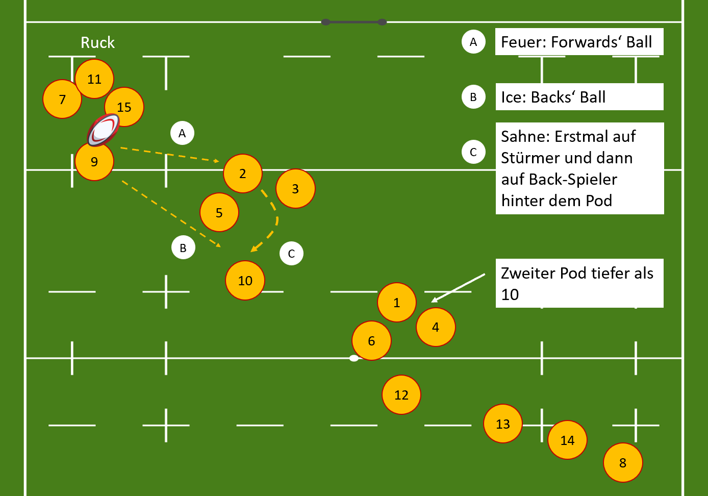

<!-- to do: 

-->

## 1. Structure

### Allgemeine Forward Struktur

## 2. Attack

### Calls
#### Feuer:
- von der 9 auf ein Stürmer-Pod

#### Eis:
- von der 9 auf eine Backs-Spielerin

#### Exit:
- der Ball wird bei einer Ruck-Situation rausgekickt
- entweder von der 9 selbst oder zuerst auf die 10/15 gepasst und dann gekickt

#### Fiji:
- der Ball wird von der 9 auf ein Stürmer-Pod gepasst
- vom Stürmer-Pod wird direkt auf eine Spielerin, die sich hinter dem Pod befindet,
gepasst

#### Sahne:
- aus einer Ruck-Situation passt die 9 den Ball zu der 10 (bzw. irgendeiner Backs-Spielerin)
- von der 10 wird weiter auf ein Stürmer-Pod gepasst

### Nach dem Lineout/Scrum (Backs)

#### One:
<video width="80%" height="80%" controls>
  <source src="media/one.mp4" type="video/mp4">
  Your browser does not support the video tag.
</video>

#### Two:
<video width="80%" height="80%" controls>
  <source src="media/two.mp4" type="video/mp4">
  Your browser does not support the video tag.
</video>

### Plus und Minus (Forwards)

## 3. Defense

